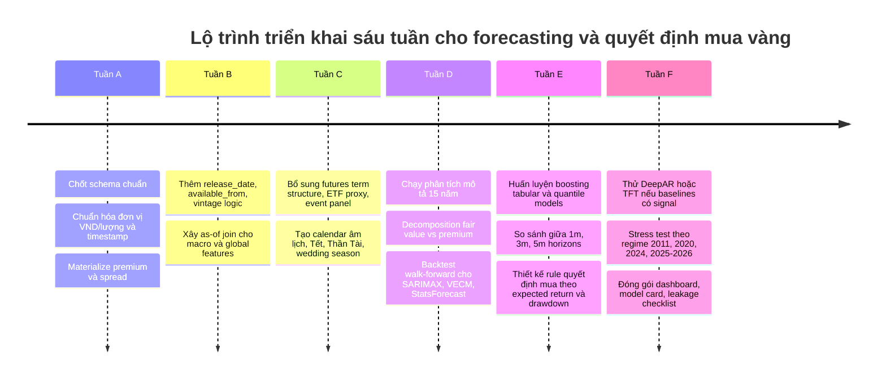

# Nghiên cứu sâu về các yếu tố chi phối giá vàng Việt Nam và nhu cầu dữ liệu cho forecasting và quyết định mua vàng

## Tóm tắt điều hành

Giá vàng trong nước tại Việt Nam không nên được xem như một chuỗi giá đơn lẻ, mà là kết quả của ít nhất bốn lớp động lực chồng lên nhau: giá vàng chuẩn toàn cầu bằng USD, tỷ giá USD/VND, phần bù nội địa do cơ chế cung ứng và quản lý thị trường, và chênh lệch vi mô ở cấp nguồn/đại lý giữa giá mua vào và bán ra. Cấu trúc thị trường vàng miếng ở Việt Nam khiến lớp “phần bù nội địa” trở nên đặc biệt quan trọng: Ngân hàng Nhà nước là cơ quan quản lý hoạt động kinh doanh vàng, Nhà nước độc quyền sản xuất vàng miếng và nhập khẩu vàng nguyên liệu để sản xuất vàng miếng, còn việc kinh doanh vàng miếng là ngành kinh doanh có điều kiện; điều này làm cho cung vàng miếng SJC mang tính hành chính hơn là hoàn toàn thị trường. Reuters cũng ghi nhận trong năm 2024 giá vàng miếng trong nước cao hơn đáng kể so với giá quốc tế, NHNN phải khôi phục đấu thầu sau hơn một thập kỷ, và các doanh nghiệp trong ngành kêu gọi nới cơ chế nhập khẩu để tăng thanh khoản và thu hẹp premium nội địa. citeturn14view3turn22news0turn22news2turn13view0

Với mục tiêu dự báo và ra quyết định mua vàng ở các chân trời một, ba và năm tháng, kho dữ liệu hiện tại của bạn đã có nền tảng mạnh ở ba mảng cốt lõi: giá vàng nội địa nhiều nguồn trong khoảng 2010–2026, dữ liệu FX trong nước, và một lớp external features gồm chuỗi toàn cầu, chuỗi vĩ mô, và chuỗi thị trường Việt Nam. Đây là nền đủ tốt để làm ba việc ngay: xây dựng chuỗi vàng nội địa “golden dataset” nhất quán theo ngày, tính phần bù nội địa so với vàng quốc tế quy đổi sang VND/lượng, và chạy các baseline nghiêm túc như SARIMAX, VECM và boosting trên đặc trưng lagged. Tuy nhiên, để ra quyết định giao dịch thực sự đáng tin cậy, bạn còn thiếu hoặc mới chỉ có một phần các biến mang tính quyết định về market microstructure và thời điểm công bố dữ liệu: cấu trúc kỳ hạn futures để tính basis/contango/backwardation, open interest/volume, ETF flows, lịch sự kiện chính sách vàng trong nước, dữ liệu tin tức/sentiment, và quan trọng nhất là metadata “observation_date” so với “release_date” hoặc “vintage date” để triệt tiêu leakage. FRED nhấn mạnh rõ API và ALFRED hỗ trợ lịch sử quan sát lẫn lịch sử revision/vintage; World Bank API cũng yêu cầu tổ chức truy cập theo phiên bản và cấu trúc gọi chuẩn, nhưng không đủ để thay thế hoàn toàn metadata công bố theo thời điểm sử dụng trong backtest. citeturn60view2turn25view1turn59view0turn59view1

Về mặt quyết định đầu tư, mô hình tốt nhất cho vàng Việt Nam trong giai đoạn đầu không phải là một “deep model” phức tạp ngay lập tức, mà là một hệ thống hai tầng. Tầng thứ nhất là mô hình hóa “fair value” của giá vàng nội địa theo công thức gần đúng: giá vàng chuẩn quốc tế × USD/VND × hệ số quy đổi sang lượng, sau đó tách riêng premium nội địa và spread bán lẻ. Tầng thứ hai là dự báo phân phối xác suất của ba đại lượng cho các kỳ hạn một, ba và năm tháng: lợi suất của giá bán ra, biến động/drawdown, và xác suất premium nội địa co hẹp hay mở rộng. Cách tiếp cận này bám đúng cấu trúc thị trường Việt Nam hơn là dự báo trực tiếp một chuỗi “sell_price” duy nhất. Nó cũng phù hợp với tài liệu học thuật về safe-haven, uncertainty, lãi suất thực và multi-horizon forecasting, cũng như các framework open-source hiện đại như StatsForecast, Prophet, GluonTS/DeepAR và Temporal Fusion Transformer. citeturn45academia10turn34academia1turn34academia0turn39view0turn39view1turn39view2turn39view3

Kết luận thực dụng là: bạn **đã có đủ dữ liệu để bắt đầu phân tích 15 năm, làm decomposition và chạy baseline có giá trị**, nhưng **chưa có đủ dữ liệu để tuyên bố hệ thống trading/ra quyết định mạnh ở mức production**. Khoảng trống lớn nhất không nằm ở số lượng rows, mà ở ba điểm: chuẩn hóa thời điểm quan sát, biến premium/basis và dữ liệu sự kiện-thanh khoản. Nếu ba điểm này được bổ sung đúng cách, bài toán một, ba và năm tháng sẽ chuyển từ “forecast giá” sang “forecast trạng thái thị trường vàng Việt Nam”, và chất lượng quyết định mua sẽ tăng rõ rệt. citeturn14view3turn22news0turn57view2turn54view0turn49view0

## Khung lý thuyết và tổng quan tài liệu

Trong văn liệu quốc tế, các driver mạnh và bền vững nhất của vàng là lãi suất thực, sức mạnh đồng USD, kỳ vọng lạm phát, căng thẳng tài chính và bất định địa chính trị. FRED công bố trực tiếp lợi suất TIPS mười năm DFII10 như một proxy chuẩn cho lãi suất thực và DGS10 cho lợi suất danh nghĩa; VIX và broad dollar index cũng có chuỗi chính thức trên FRED. Về mặt trực giác kinh tế, khi lãi suất thực giảm, chi phí cơ hội của việc nắm giữ vàng giảm; khi USD yếu, vàng định giá bằng USD thường được hỗ trợ; khi bất định tài chính và địa chính trị tăng, vàng thường được dùng như tài sản trú ẩn. Kết quả này phù hợp với tài liệu học thuật về vai trò hedge/safe haven của vàng và với nghiên cứu gần đây cho thấy tác động của uncertainty lên vàng phụ thuộc vào regime thị trường, mạnh hơn ở các trạng thái bất định cao. citeturn25view1turn25view2turn25view3turn25view4turn45academia10

Với vàng Việt Nam, cùng một bộ driver vĩ mô toàn cầu vẫn quan trọng, nhưng không đủ. Thị trường nội địa có thêm một kênh truyền dẫn riêng: cấu trúc pháp lý và nguồn cung vàng miếng. Trang thông tin chính thức của NHNN nêu rõ Nhà nước độc quyền sản xuất vàng miếng, nhập khẩu vàng nguyên liệu để sản xuất vàng miếng, và NHNN có vai trò thực hiện mua bán vàng miếng trên thị trường trong nước theo quyết định của Thủ tướng. Reuters ghi nhận trong năm 2024 khoảng cách giữa giá vàng trong nước và giá quốc tế nới rộng đáng kể, premium lên tới khoảng 1.000 USD/tael vào một số thời điểm, NHNN phải tái khởi động đấu thầu vàng, đồng thời doanh nghiệp ngành vàng lập luận rằng nhập khẩu bị kiểm soát chặt đã làm thanh khoản nội địa suy yếu. Do đó, đối với Việt Nam, mô hình nào bỏ qua “chế độ cung ứng” và “policy regime” gần như chắc chắn sẽ bỏ sót biến quan trọng nhất của premium nội địa. citeturn14view3turn22news0turn22news2

Khía cạnh market microstructure cũng đáng chú ý. SJC công bố giá vàng theo đơn vị nghìn đồng một lượng và tách rõ giá mua vào, bán ra; bản thân cấu trúc bid–ask này đã mang thông tin về căng thẳng thanh khoản nội địa. SJC còn có trang biểu đồ/tra cứu giá vàng theo ngày, cho thấy đây là nguồn phù hợp để tạo daily reference series. Trong khi đó, ICE Benchmark Administration mô tả LBMA Gold Price là benchmark toàn cầu cho vàng unallocated tại London, hình thành qua đấu giá điện tử vào 10:30 và 15:00 London time, được công bố bằng USD rồi quy đổi sang GBP và EUR; benchmark này được các ngân hàng trung ương, nhà đầu tư và các bên tham gia thị trường dùng như reference price. Kết hợp hai nguồn này cho phép xây dựng biến có sức giải thích rất cao cho Việt Nam: `domestic_premium = SJC_VND_per_luong - LBMA_USD_per_oz * USDVND * conversion_factor`. Đây không chỉ là feature; trong thực tế, nó là “đại lượng trạng thái” then chốt của thị trường vàng Việt Nam. citeturn49view0turn50view0turn57view2

Ở nhánh futures và theory of storage, biến contango/backwardation không phải là chi tiết phụ. ICE/LBMA cho thấy benchmark vàng toàn cầu là một benchmark auc­tion chính thức; CME mô tả gold futures là benchmark futures dẫn dắt thanh khoản toàn cầu, gần như giao dịch hai mươi bốn giờ và gắn chặt với cash market thông qua cơ chế physical settlement. Lý thuyết storage cho rằng chênh lệch giữa spot và futures phản ánh chi phí carry và convenience yield; khi hàng hóa khan hiếm hơn hoặc nhu cầu nắm giữ tồn kho lớn hơn, backwardation xuất hiện dễ hơn, còn khi thị trường dư cung hơn thì contango dễ quan sát hơn. Đối với vàng Việt Nam, bạn không có inventory vật chất chuẩn hóa như dầu hoặc kim loại công nghiệp, nhưng term structure của COMEX/GC vẫn là proxy có ích cho khẩu vị rủi ro, carry và cấu trúc kỳ vọng của thị trường vàng toàn cầu. citeturn57view3turn58view1turn47search0turn47search6

Về yếu tố hành vi và nhu cầu nội địa, bằng chứng cho Việt Nam chủ yếu đến từ báo cáo ngành và tin tức thị trường hơn là dữ liệu học thuật chuẩn hóa dài hạn. Reuters dẫn lời đại diện ngành vàng Việt Nam rằng nhu cầu bán lẻ tăng mạnh trong 2024 do lãi suất tiết kiệm giảm mạnh, bất động sản đóng băng và VND mất giá so với USD; hiện tượng người dân xếp hàng mua vàng được ghi nhận công khai. Điều này gợi ý ít nhất ba nhóm biến cần được đưa vào mô hình quyết định mua vàng ở Việt Nam: biến mùa vụ theo lịch âm/Tết/Thần Tài/mùa cưới, biến cạnh tranh tài sản thay thế trong nước như lãi suất tiền gửi và VNINDEX/bất động sản proxy, và biến hành vi-tin tức như cường độ tìm kiếm/tần suất tin về vàng, NHNN, nhập khẩu, đấu thầu và chênh lệch premium. citeturn22news2turn53view0

## Bản đồ biến cần thu thập

Bảng dưới đây tập trung vào các biến **crawlable** và **actionable** nhất cho một hệ thống forecasting/trading vàng Việt Nam. Tôi chia thành nhóm “phải có”, “nên có”, và “bổ sung nâng cao”. Trường `lag handling` là phần quan trọng nhất để tránh leakage.

| Driver | Biến cụ thể cần thu thập | Source / API / URL | Tần suất | Lag handling | Priority | Vì sao cần |
|---|---|---|---|---|---|---|
| Giá vàng chuẩn toàn cầu | `lbma_gold_am_usd_oz`, `lbma_gold_pm_usd_oz` | ICE IBA LBMA Precious Metals, `https://www.ice.com/iba/lbma-precious-metals` citeturn57view2 | Daily | Với phiên VN ngày *t*, chỉ dùng benchmark đã công bố trước thời điểm chốt quote VN; nếu quote VN có giờ không rõ, dùng `t-1` an toàn | Phải có | Neo chuẩn toàn cầu cho mọi phép quy đổi và premium |
| Tỷ giá USD/VND chính sách | `sbv_central_usdvnd` | SBV tỷ giá trung tâm, trang tỷ giá NHNN citeturn13view0 | Daily business day | Join theo ngày công bố NHNN; không forward fill qua ngày chưa công bố nếu đang backtest intraday | Phải có | Kênh truyền dẫn trực tiếp từ vàng USD sang VND |
| Tỷ giá ngân hàng thương mại | `vcb_usd_buy_cash`, `vcb_usd_buy_transfer`, `vcb_usd_sell`, cùng các cặp chính | Vietcombank FX page, XML/Excel reference được Vietcombank công bố trên trang tỷ giá citeturn54view0 | Daily/intraday snapshot | Lưu cả `update_time`; cuối ngày dùng bản snapshot cuối trước cut-off VN | Phải có | Phản ánh tỷ giá bán lẻ/thanh khoản thực tế hơn central rate |
| Giá vàng nội địa nguồn gốc | `sjc_buy`, `sjc_sell`, `pnj_buy`, `pnj_sell`, `webgia_sjc_buy/sell`, `giavang_sjc_buy/sell` | SJC chính thức và các nguồn audited nội bộ; SJC công bố giá theo nghìn đồng/lượng, mua/bán citeturn49view0turn50view0 | Daily hoặc intraday tùy crawl | Chuẩn hóa về daily close theo giờ VN, lưu `quote_time` gốc | Phải có | Target chính và cross-source consensus |
| Premium nội địa | `sjc_premium_vs_lbma`, `pnj_premium_vs_lbma`, `webgia_premium_vs_lbma`, `source_dispersion` | Tự tính từ vàng nội địa + LBMA + USD/VND | Daily | Chỉ dùng data quốc tế và FX đã có sẵn trước cut-off quote nội địa | Phải có | Biến trạng thái quan trọng nhất của thị trường Việt Nam |
| Spread bán lẻ | `bid_ask_spread_abs`, `bid_ask_spread_pct`, `spread_zscore` | Tự tính từ giá mua/bán từng nguồn | Daily/intraday | Không dùng spread hình thành sau thời điểm ra quyết định | Phải có | Proxy thanh khoản và stress vi mô |
| Lãi suất thực Mỹ | `DFII10`, có thể thêm `DFII5` | FRED series pages / API `fred/series/observations` citeturn25view1turn60view2 | Daily | Dùng `t-1` cho quyết định mở cửa VN ngày *t* | Phải có | Driver học thuật mạnh của vàng |
| Lãi suất danh nghĩa / kỳ vọng lạm phát | `DGS10`, `T10YIE`, `T5YIE` | FRED / H.15 release citeturn25view2turn25view1turn60view2 | Daily | Same as above | Phải có | Tách kênh real-rate và inflation-expectation |
| Sức mạnh USD toàn cầu | `DTWEXBGS` hoặc DXY proxy | FRED broad dollar index citeturn25view4turn60view2 | Daily | `t-1` cho VN | Phải có | Vàng thường nhạy với USD |
| Stress / risk-off toàn cầu | `VIXCLS`, có thể thêm credit spread hoặc STLFSI/NFCI | FRED VIX + stress indices citeturn25view3turn60view2 | Daily | `t-1` cho VN | Nên có | Safe-haven demand và risk sentiment |
| Gold futures structure | `gc_front`, `gc_next`, `basis_pct`, `calendar_spread`, `roll_yield`, `open_interest`, `volume` | CME/COMEX official specs + market data vendor; nếu không có vendor thì dùng futures chain/yfinance như proxy, nhưng cờ `source_quality=proxy` citeturn57view3turn58view1 | Daily | Cố định contract mapping theo rule roll; tránh look-ahead khi chọn front month | Phải có | Contango/backwardation và pressure trên futures |
| ETF / flows tài chính | `GLD_close`, `GLD_volume`, `GLD_shares_outstanding`, `IAU_*` | Issuer pages / Nasdaq / yfinance proxy; nếu không có official shares thì đánh dấu proxy | Daily | `t-1` | Nên có | Đo vốn vào/ra “financial gold” |
| Vĩ mô Việt Nam có release lag | `cpi_yoy`, `cpi_mom`, `industrial_production`, `retail_sales`, `credit_growth`, `money_supply`, `policy_rate`, `deposit_rate`, `trade_balance` | GSO/NSO, SBV statistics, World Bank API cho phần annual/structural. WB V2 API: `https://api.worldbank.org/v2/...` citeturn59view0turn59view1turn13view0 | Monthly / quarterly / annual | Bắt buộc lưu `observation_date`, `release_date`, tốt nhất `vintage_date`; chỉ join “as-of” thời điểm quyết định | Phải có | Tái hiện bối cảnh vĩ mô nội địa và tránh leakage |
| Tài sản thay thế trong nước | `VNINDEX_close`, `bank_deposit_rate`, `usd_free_market_proxy` nếu hợp lệ | `vnstock` cho VNINDEX; SBV/Vietcombank cho lãi suất và FX liên quan citeturn53view0turn13view0 | Daily / monthly | As-of join | Nên có | Nhu cầu chuyển đổi giữa vàng, cổ phiếu, tiền gửi, USD |
| Lịch sự kiện chính sách vàng | `auction_dummy`, `sbv_policy_dummy`, `import_policy_dummy`, `inspection_news_dummy` | SBV gold management pages + NHNN auction announcements + Reuters timeline cho historical tagging citeturn14view3turn16view0turn22news0turn22news2 | Event-based | Event window phải đóng dấu ngày công bố và ngày hiệu lực | Phải có | Premium nội địa thường nhảy theo policy regime |
| Mùa vụ nhu cầu nội địa | `tet_proximity`, `than_tai_day`, `wedding_season`, `month_sin/cos`, `weekday`, `holiday_bridge` | Tự sinh từ calendar dương và lịch âm; kết hợp rule-based | Daily | Known-in-advance, không gây leakage | Phải có | Nhu cầu vàng trang sức/tích trữ mang tính mùa vụ rõ |
| Tin tức và dòng thông tin | `gold_news_count_vn`, `nhnn_gold_news_count`, `geopolitical_news_count`, `sentiment_score`, `attention_index` | GDELT / RSS / báo chính thống / Google Trends nếu crawl được; nếu không có API key thì bắt đầu từ RSS và GDELT public | Daily / intraday aggregate | Chỉ dùng bản tin đã xuất hiện trước cut-off | Nên có | Bổ sung layer hành vi và regime shifts |
| Geopolitical risk | `gpr_proxy`, `war_dummy`, `oil_shock_dummy`, `conflict_news_count` | ACLED / GDELT / author GPR data nếu truy cập được; ưu tiên public crawl | Daily/weekly | Event-time join, tránh backfill tương lai | Nên có | Vàng phản ứng mạnh với bất định địa chính trị |
| Chất lượng nguồn | `source_reliability_score`, `revision_flag`, `missing_flag`, `stale_flag`, `intraday_flag` | Tự sinh từ pipeline audit | Daily | Là metadata, luôn được giữ riêng khỏi target | Phải có | Giúp mô hình biết lúc nào dữ liệu kém tin cậy |

Một tập endpoint mẫu tối thiểu mà bạn có thể crawl ngay, không cần API key trả phí đặc thù, có thể tổ chức như sau:

```text
# World Bank V2 API
https://api.worldbank.org/v2/country/VNM/indicator/FP.CPI.TOTL.ZG?format=json
https://api.worldbank.org/v2/country/VNM/indicator/NY.GDP.MKTP.KD.ZG?format=json

# FRED API structure
https://api.stlouisfed.org/fred/series/observations?series_id=DFII10&file_type=json&api_key=YOUR_KEY
https://api.stlouisfed.org/fred/series/observations?series_id=DGS10&file_type=json&api_key=YOUR_KEY
https://api.stlouisfed.org/fred/series/observations?series_id=DTWEXBGS&file_type=json&api_key=YOUR_KEY
https://api.stlouisfed.org/fred/series/observations?series_id=VIXCLS&file_type=json&api_key=YOUR_KEY

# Official Vietnam references
https://www.sbv.gov.vn/vi/tỷ-giá
https://www.vietcombank.com.vn/vi-VN/KHCN/Cong-cu-Tien-ich/Ty-gia
https://sjc.com.vn/bieu-do-gia-vang
```

FRED API documentation nêu rõ endpoint `fred/series/observations` để lấy giá trị quan sát của một chuỗi và phân biệt FRED với ALFRED theo hướng current data so với lịch sử revision/vintage; World Bank documentation nêu rõ V2 API và cấu trúc gọi chuẩn cho indicators. Đối với hệ thống forecasting tránh leakage, phần quan trọng không chỉ là gọi được API, mà là phải lưu đồng thời bản thân **giá trị quan sát**, **ngày quan sát**, **ngày công bố/available date**, và khi khả thi là **vintage date**. citeturn60view2turn25view1turn59view0turn59view1

## Đối chiếu inventory hiện tại và khoảng trống

Đối chiếu dưới đây dựa trên inventory bạn đã mô tả: `raw_gold_15y_full`, `external_features`, `audited`, cùng các file đã upload (`domestic_gold_quotes.csv`, `fx_rates.csv`, `global_market_series.csv`, `macro_series.csv`, `vn_market_series.csv` và các archive JSONL theo nguồn). Vì tôi không có schema machine-readable đầy đủ trong phản hồi hiện tại, phần “trường hiện có” được đánh giá theo **mức độ bao phủ nghiệp vụ** thay vì khẳng định tuyệt đối từng column name. Ở những chỗ cần sự chính xác tuyệt đối ở mức cột, tôi ghi rõ là “cần xác nhận từ schema thực tế”.

| Nhóm biến cần có | Tình trạng trong inventory hiện tại | Nhận định | Rủi ro chất lượng chính |
|---|---|---|---|
| Giá vàng nội địa đa nguồn 2010–2026 | **Có** | Đây là tài sản dữ liệu mạnh nhất của bạn. `raw_gold_15y_full` và `audited` đủ để phân tích dài hạn và xây consensus series | Rủi ro timestamp, trùng quote trong ngày, khác đơn vị và khác quy ước quote giữa nguồn |
| Audit source reliability / missing / outlier / leakage report | **Có** | Đây là lợi thế rất lớn. Phần lớn đội làm forecasting hàng hóa không có lớp audit tốt như vậy | Cần đảm bảo quality report đi kèm từng phiên bản dataset, không chỉ snapshot cuối |
| FX trong nước từ Vietcombank + SBV | **Có** | Đã đủ để tạo lớp truyền dẫn USD/VND | Phải phân biệt central rate với retail bank rate; khác thời điểm cập nhật; Vietcombank có dữ liệu intraday snapshot trên trang tỷ giá citeturn54view0turn13view0 |
| Global market series từ yfinance + FRED | **Có nhưng cần kiểm kê chi tiết** | Rất có thể đã có nhiều driver quan trọng như vàng quốc tế, DXY, yields, VIX, dầu, equity indices | Nguy cơ dùng close của thị trường Mỹ sau giờ đóng cửa Việt Nam cho phiên VN cùng ngày gây leakage |
| Macro series từ World Bank + GSO macro monitor | **Có nhưng dễ leakage** | Bao phủ vĩ mô là tốt, nhưng nếu chưa có `release_date` hay `vintage_date` thì backtest sẽ lạc quan giả tạo | Rủi ro cao nhất là join theo `observation_date` thay vì ngày mà thị trường thực sự biết thông tin citeturn59view0turn60view2 |
| VN market series từ `vnstock` VNINDEX | **Có nhưng còn hẹp** | Hữu ích cho kênh tài sản thay thế trong nước | Chưa chắc có breadth/sector/liquidity nội địa; nên mở rộng ngoài VNINDEX |
| Premium nội địa vs vàng quốc tế | **Có thể suy ra, nhưng chưa chắc đã materialized** | Bạn gần như chắc chắn đủ thành phần để tính premium | Nếu chưa materialize thành một bảng chuẩn, mô hình sẽ bỏ lỡ feature mạnh nhất |
| Spread mua–bán nội địa | **Có thể đã có trực tiếp hoặc suy ra** | Cần được standardize thành biến riêng | Spread bị méo nếu trong ngày có nhiều snapshot không timestamp |
| Futures basis / contango / backwardation | **Khả năng thiếu** | `global_market_series` có thể có `GC=F`, nhưng chưa đủ để tính term structure đúng chuẩn | Dùng một continuous future duy nhất sẽ không suy ra basis và roll yield |
| Open interest / volume futures | **Khả năng thiếu** | Rất quan trọng cho tín hiệu positioning | yfinance thường không ổn định cho lịch sử open interest liên tục |
| ETF holdings / flows | **Khả năng thiếu** | Nên bổ sung | Dữ liệu proxy từ giá GLD không thay thế được shares outstanding |
| News / sentiment / event calendar | **Thiếu** | Đây là gap rõ ràng nhất cho regime shifts | Thiếu biến sự kiện khiến mô hình phản ứng chậm với các cú sốc policy/geopolitics |
| Lịch sự kiện vàng Việt Nam | **Thiếu hoặc rời rạc** | Nên tạo bảng thủ công/bán tự động riêng | Bỏ sót auction/policy/import event sẽ làm premium “trông như outlier ngẫu nhiên” |
| Lãi suất tiền gửi / opportunity cost nội địa | **Có thể có một phần trong macro** | Nên materialize thành series chuẩn | Nếu chỉ có monthly aggregate mà thiếu release lag thì hiệu lực realtime kém |
| Calendar âm lịch / Thần Tài / Tết / mùa cưới | **Thiếu hoặc chưa chuẩn hóa** | Dễ bổ sung, tác động cao | Nếu bỏ qua sẽ khiến mô hình nhầm seasonality thành shock |

Điểm quan trọng nhất trong gap analysis là: bạn **không thiếu lịch sử giá**, nhưng vẫn **thiếu lịch sử “context as-of-time”**. Đối với bài toán đầu tư một, ba và năm tháng, điều làm hỏng hệ thống hiếm khi là thiếu thêm vài nghìn rows; thường là do dùng sai thời điểm thông tin, sai mapping contract futures, hoặc gộp premium nội địa với movement của giá thế giới thành một target duy nhất. citeturn25view1turn60view2turn22news0turn22news2

Tôi khuyến nghị chuẩn hóa lại inventory hiện có thành bốn bảng mô hình hóa rõ ràng hơn:

1. `gold_domestic_daily_panel`: một row cho mỗi `date × source × product_type`, với buy, sell, spread, quote_time, reliability score.  
2. `global_reference_daily`: LBMA, USD/VND, yields, dollar, VIX, dầu, equities, futures basis.  
3. `vn_macro_asof_panel`: mọi chỉ tiêu vĩ mô có cả `observation_date`, `release_date`, `available_from`, `value`.  
4. `event_regime_panel`: đấu thầu, policy change, inspection, import rumor, chiến sự, Thần Tài, Tết, wedding season.

Khi có bốn bảng này, bài toán forecasting sẽ trở nên minh bạch hơn nhiều: giá nội địa = giá quy đổi toàn cầu + premium nội địa + spread, còn quyết định mua là hàm của expected return sau spread, expected premium reversion và downside risk. citeturn49view0turn57view2turn54view0turn22news0turn22news2

### Rủi ro dữ liệu và quy tắc tiền xử lý tối thiểu

Các quy tắc dưới đây là “minimum viable discipline” nếu bạn muốn forecast dùng được cho quyết định đầu tư.

| Hạng mục | Quy tắc tối thiểu đề xuất |
|---|---|
| Daily close selection | Với vàng nội địa, chọn quote cuối cùng trước cut-off thống nhất, ví dụ 17:00 Asia/Ho_Chi_Minh. Nếu không có timestamp đầy đủ, chỉ dùng daily snapshot đã ổn định và không trộn với intraday. |
| Unit normalization | Chuẩn hóa mọi giá về `VND/lượng` và giữ thêm `VND/chỉ` nếu source bán lẻ dùng chỉ. SJC công bố theo nghìn đồng/lượng; phải scale nhất quán. citeturn49view0turn50view0 |
| De-dup | Khóa tối thiểu: `source + product + datetime_exact` hoặc `source + product + date + quote_rank`. Nếu cùng timestamp có nhiều record, ưu tiên source reliability cao hơn. |
| Outlier rule | Không winsorize mù. Trước tiên so với cross-source median và so với biến premium. Flag nếu `abs(return)` quá lớn nhưng cùng ngày không có xác nhận từ nguồn chính thức hay policy event. |
| Spread handling | Luôn tách `buy`, `sell`, `mid`, `spread_abs`, `spread_pct`. Mô hình quyết định mua nên dùng giá **bán ra** làm execution price và lợi suất realized nên trừ round-trip spread phù hợp. |
| Premium calculation | `premium = domestic_mid - global_gold_vnd_per_luong`. Giữ riêng `premium_buy` và `premium_sell` nếu muốn mô phỏng execution thực hơn. |
| Exogenous lagging | Mọi biến từ thị trường Mỹ/châu Âu dùng ít nhất `t-1` cho quyết định ngày *t* ở Việt Nam, trừ khi bạn có timestamp và xác định rõ đã xảy ra trước cut-off VN. |
| Macro lagging | Join theo `available_from`, không theo `observation_date`. Với World Bank annual series, coi availability chậm và chỉ cập nhật khi thực sự công bố. |
| Futures rolling | Xác định rõ rule roll, ví dụ roll trước first notice day hoặc theo volume/open interest crossover; lưu `contract_code` để audit. |
| Source reliability | Dùng `audited` làm backbone huấn luyện. WebGia/Giavang phù hợp để kiểm tra coverage và cross-source dispersion hơn là làm source duy nhất cho target. |
| Staleness | Vietcombank page gold cho thấy dữ liệu có thể stale theo ngày cập nhật; đừng dùng vô điều kiện như benchmark vàng nội địa. citeturn55view0turn55view3 |

## Mô hình nền tảng và kế hoạch đánh giá

Một lộ trình mô hình hóa hợp lý cho bài toán của bạn nên đi từ mô hình kinh tế lượng diễn giải được sang mô hình ML đa biến, rồi mới tới deep learning multi-horizon. Không nên đi ngược chiều.

| Model | Vì sao phù hợp | Feature bắt buộc | Ưu điểm / nhược điểm | Paper / code |
|---|---|---|---|---|
| SARIMAX | Baseline chuẩn cho chuỗi đơn với exogenous regressors; statsmodels hỗ trợ trực tiếp SARIMAX | Giá vàng nội địa, lags, USD/VND, vàng quốc tế, DXY, lãi suất thực, seasonality | Dễ diễn giải, mạnh ở baseline; yếu khi regime shift phi tuyến lớn | statsmodels SARIMAX docs citeturn40view0 |
| VECM | Phù hợp nếu vàng nội địa, vàng quốc tế quy đổi và USD/VND có quan hệ đồng liên kết dài hạn | Chuỗi level đã kiểm tra cointegration, exog policy/event | Rất hợp cho decomposition fair value/premium; cần kiểm định nghiêm túc | statsmodels VECM docs citeturn41view0 |
| Prophet / Dynamic regression | Tốt cho trend + nhiều seasonality + holiday features như Tết/Thần Tài | Target daily, holiday/calendar, extra regressors | Triển khai nhanh, dễ đọc; không đủ mạnh cho microstructure | Prophet repo mô tả hỗ trợ multiple seasonality và extra regressors citeturn39view1 |
| StatsForecast baselines | Bộ baseline mạnh gồm AutoARIMA, ETS, Theta, Naive, Seasonal Naive | Univariate target và optionally exogenous cho một số model | Rất phù hợp cho benchmark nghiêm túc, nhanh và reproducible | StatsForecast repo citeturn39view0 |
| XGBoost / LightGBM trên tabular lags | Thường rất mạnh cho dữ liệu tài chính phi tuyến, nhiều lag, interaction và event dummies | Lags đa cửa sổ, rolling stats, premium, spread, event dummies, macro as-of | Hiệu quả cao, linh hoạt; cần chống leakage cẩn thận | XGBoost và LightGBM là boosting framework chuẩn, dùng rộng rãi trong tabular forecasting citeturn32search1turn32search0 |
| DeepAR | Hữu ích khi bạn muốn probabilistic forecasting và có nhiều related series như nhiều nguồn, nhiều product type | Multi-series panel, covariates, calendar, global features | Tốt cho phân phối dự báo; cần data engineering kỹ | DeepAR paper + GluonTS implementation citeturn34academia1turn39view3 |
| Temporal Fusion Transformer | Rất hợp cho multi-horizon forecasting một, ba, năm tháng với known-future covariates và historic covariates | Static features, calendar future-known, historic exogenous, multi-horizon target | Mạnh, giải thích bằng variable selection/attention; dữ liệu phải chuẩn as-of | TFT paper + pytorch-forecasting implementation citeturn34academia0turn39view2 |

### Bộ thí nghiệm baseline khuyến nghị

Tôi khuyến nghị bộ thí nghiệm tối thiểu sau đây, theo thứ tự tăng dần về độ khó:

| Experiment | Target | Horizon | Mục tiêu |
|---|---|---|---|
| Fair-value decomposition | `global_gold_vnd_per_luong`, `premium`, `spread` | Daily and monthly | Kiểm tra xem premium nội địa là mean-reverting hay regime-switching |
| SARIMAX baseline | `sjc_sell` hoặc `sjc_mid` | 1m, 3m, 5m | Benchmark kinh tế lượng có exogenous |
| VECM | `sjc_mid`, `global_gold_vnd_per_luong`, `usd_vnd` | 1m, 3m, 5m | Tách quan hệ dài hạn và sai lệch ngắn hạn |
| Boosting tabular | future return của `sjc_sell` | 21d, 63d, 105d trading days | Bắt quan hệ phi tuyến và event interaction |
| Quantile model | quantiles của future return | 1m, 3m, 5m | Hỗ trợ quyết định mua theo downside risk |
| TFT / DeepAR | multi-horizon distribution | 1m, 3m, 5m | Mô hình production candidate nếu baselines chứng minh có giá trị |

### Protocol đánh giá nên dùng

Đánh giá phải là **walk-forward expanding window** hoặc **rolling-origin backtest**, tuyệt đối không random split. Với horizon một, ba, năm tháng, bạn nên tạo ba task riêng: 21 ngày giao dịch, 63 ngày giao dịch, 105 ngày giao dịch. Mỗi task cần ít nhất các metric sau: MAE/RMSE cho giá, MAPE hoặc sMAPE cho scale comparability, directional accuracy cho dấu lợi suất, hit rate của quantiles, và đặc biệt là metric quyết định như **excess return over savings rate**, **max drawdown**, **turnover**, **premium-adjusted entry quality**. FRED và ALFRED tồn tại chính là để xử lý real-time revision problem; nếu evaluation không “as-of”, mọi so sánh mô hình đều dễ bị lạc quan giả. citeturn60view2turn25view1turn39view0turn39view3turn34academia0turn34academia1

Với bài toán “có nên mua vàng trong một, ba, năm tháng tới hay không”, output tốt nhất không phải chỉ là một điểm dự báo. Tôi khuyến nghị sinh ba output cho mỗi horizon:

- `expected_return_after_spread`
- `prob_return_positive`
- `prob_drawdown_exceeds_x`

Sau đó chuyển thành luật quyết định. Ví dụ, chỉ phát tín hiệu “mua” khi expected return sau spread vượt một ngưỡng tối thiểu và xác suất lỗ sâu dưới ngưỡng chấp nhận. Cách này phù hợp hơn nhiều so với biến quyết định nhị phân đơn giản. citeturn34academia1turn34academia0turn39view3turn39view2

## Kế hoạch hành động ưu tiên và lộ trình sáu tuần

### Danh sách ưu tiên thực thi

Ưu tiên cao nhất không phải là thu thêm thật nhiều nguồn mới, mà là hoàn thiện “hệ đo lường đúng”.

- **Chuẩn hóa target và decomposition**: tạo `global_gold_vnd_per_luong`, `premium`, `spread`, `consensus_mid` làm bộ biến chuẩn.  
- **Bổ sung metadata thời gian**: mọi external feature cần `observation_date`, `release_date`, `available_from`, `source_timezone`, `retrieved_at`.  
- **Bổ sung futures structure**: ít nhất hai kỳ hạn GC để tạo basis và roll yield; nếu chưa có vendor chuẩn, dùng proxy nhưng gắn cờ chất lượng.  
- **Xây event panel cho Việt Nam**: đấu thầu vàng, thay đổi chính sách, tin điều tra/siết thị trường, thay đổi cung/import, ngày Thần Tài, Tết.  
- **Mở rộng features nội địa**: lãi suất tiền gửi, VNINDEX và các proxy cạnh tranh tài sản; nếu có thể, thêm dữ liệu tìm kiếm/tin tức vàng.  
- **Chạy baselines trước deep learning**: SARIMAX, VECM, AutoARIMA/ETS/Theta, XGBoost/LightGBM; chỉ khi chúng cho thấy signal rõ ràng mới nâng lên TFT/DeepAR.  

### Lộ trình sáu tuần



### Câu hỏi mở và giới hạn

Có ba giới hạn cần ghi nhận thẳng thắn.

Thứ nhất, một số nguồn Việt Nam chính thức không dễ crawl ổn định qua web parser trong phiên nghiên cứu này, đặc biệt các trang thống kê của GSO/NSO và một số trang PNJ chạy nặng JavaScript; vì vậy, phần khuyến nghị về nguồn Việt Nam ở đây ưu tiên nguồn đã xác minh được bằng văn bản chính thức của SBV, SJC, Vietcombank và các tài liệu API/quy định có thể truy cập chắc chắn. citeturn13view0turn14view3turn49view0turn54view0

Thứ hai, tôi không có schema máy đọc được đầy đủ của từng file CSV/parquet trong phản hồi cuối này, nên đánh giá inventory hiện tại được thực hiện ở cấp **bao phủ biến nghiệp vụ** thay vì audit chính xác từng column. Điều đó không ảnh hưởng nhiều tới định hướng dữ liệu cần bổ sung, nhưng trước khi modeling production bạn nên xuất riêng “data dictionary” thực tế của từng bảng, gồm tên cột, kiểu dữ liệu, timezone, null ratio và source lineage.

Thứ ba, dữ liệu vàng Việt Nam chịu ảnh hưởng cơ chế quản lý nội địa mạnh hơn nhiều so với các thị trường vàng tự do. Vì vậy, mọi mô hình học từ lịch sử đều có rủi ro regime break khi chính sách nhập khẩu, đấu thầu, phân phối vàng miếng hoặc cấu trúc thương hiệu thay đổi đột ngột. Đây là lý do tôi đề xuất mô hình hóa premium và event regime như thực thể riêng thay vì coi chúng là nhiễu. citeturn14view3turn22news0turn22news2

Nếu chỉ chọn **ba việc quan trọng nhất để làm ngay**, tôi sẽ chọn:  
(1) materialize chuỗi `global_gold_vnd_per_luong` và `premium`;  
(2) gắn `available_from` cho toàn bộ macro/external features;  
(3) bổ sung futures basis và event panel chính sách vàng Việt Nam.  

Ba việc đó sẽ quyết định phần lớn chất lượng của cả phân tích 15 năm, dự báo một–ba–năm tháng, và cuối cùng là quyết định có nên mua vàng hay không. citeturn57view2turn54view0turn14view3turn22news0