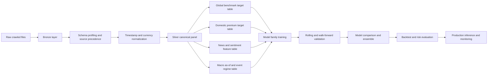
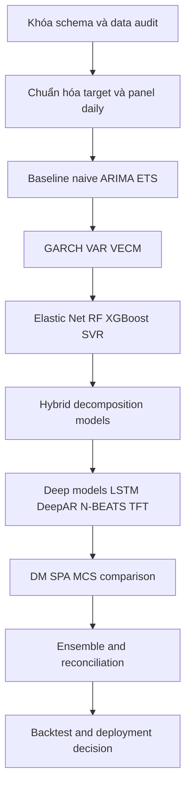

# Tổng quan tài liệu và kế hoạch phương pháp cho bài toán dự báo giá vàng

## Tóm tắt điều hành

Bài toán của bạn không nên được hiểu như một bài toán “dự báo một chuỗi giá duy nhất”, mà nên được tách thành **hai lớp dự báo liên kết**: **giá vàng tham chiếu quốc tế** và **phần chênh lệch nội địa Việt Nam so với tham chiếu quốc tế**. Cách tách này phù hợp với thực tế thị trường vàng: chuẩn giá quốc tế thường neo vào các benchmark như **LBMA Gold Price** và thị trường futures COMEX, trong khi giá nội địa còn chịu tác động của tỷ giá, premium nội địa, hạn chế cung ứng, biến cố chính sách và tâm lý truyền thông. Về mặt vi mô thị trường, LBMA Gold Price là benchmark quốc tế được thiết lập hai lần mỗi ngày qua đấu giá điện tử do ICE Benchmark Administration vận hành, còn hợp đồng vàng COMEX chuẩn là hợp đồng giao 100 troy ounce; vì thế các file bạn cung cấp về LBMA proxy, futures basis, GLD và event panel rất phù hợp để xây dựng kiến trúc dự báo nhiều tầng. citeturn17search1turn17search6turn17search14turn4search3turn4search9

Về mặt học thuật và thị trường, bằng chứng nhất quán cho thấy giá vàng chịu ảnh hưởng mạnh bởi **rủi ro và bất định**, **lãi suất thực và chi phí cơ hội nắm giữ**, **USD và tỷ giá**, **dầu thô và hàng hóa liên quan**, **dòng vốn ETF**, **mua ròng của ngân hàng trung ương**, cùng với các hiệu ứng **trú ẩn an toàn** và **động lượng theo chế độ thị trường**. World Gold Council mô tả các driver của vàng theo khung dài hạn và ngắn hạn; các nghiên cứu kinh điển của Baur–Lucey và Baur–McDermott cho thấy vai trò trú ẩn của vàng có tính điều kiện theo pha khủng hoảng; Sari và cộng sự, Zhang–Wei, Beckmann và Bilgin cùng cộng sự cho thấy vàng có liên hệ động với dầu, USD/tỷ giá và các thước đo bất định. Điều này hàm ý rằng bộ dữ liệu của bạn phải được thiết kế theo hướng **đa nguồn, đa tần suất, đa chế độ**, thay vì chỉ chạy một mô hình univariate trên chuỗi giá. citeturn1search0turn1search5turn1search2turn1search3turn5search3turn5search8turn18search2turn4search5

Về phương pháp, một kế hoạch mạnh và có khả năng triển khai thực tế nên đi theo lộ trình: **naive/random walk và ARIMA/ETS làm baseline**, sau đó **GARCH-family cho volatility**, **VAR/VECM/ARDL/SVAR cho quan hệ đa biến và đồng liên kết**, **tree boosting/SVR/regularized regression** cho phi tuyến vừa phải và khả năng diễn giải, rồi mới đến **hybrid decomposition** và **deep learning đa biến** như LSTM, DeepAR, N-BEATS hoặc Temporal Fusion Transformer cho bài toán nhiều biến ngoại sinh và nhiều chân trời dự báo. Tài liệu tổng quan gần đây về ML cho dự báo chuỗi thời gian khuyến nghị dùng benchmark cổ điển mạnh, đánh giá out-of-sample nghiêm ngặt, và chỉ chấp nhận mô hình phức tạp hơn khi chứng minh được lợi ích thống kê lẫn kinh tế. citeturn9search0turn9search4turn7search2turn7search0turn8search0

Khuyến nghị cốt lõi của báo cáo này là: **xây một bảng dữ liệu chuẩn hóa theo ngày giao dịch**, huấn luyện **nhiều horizon song song** như \(t+1\), \(t+5\), \(t+20\), triển khai **rolling-window/walk-forward validation**, dùng **MAE, RMSE, MAPE và directional accuracy** cho đánh giá thống kê, sau đó thêm **Diebold–Mariano, Hansen SPA và Model Confidence Set** để so sánh mô hình một cách nghiêm ngặt. Nếu mục tiêu cuối cùng là giao dịch hoặc hỗ trợ ra quyết định phân bổ, cần thêm lớp **backtest có chi phí giao dịch**, **Sharpe/Sortino/Calmar**, **maximum drawdown**, và kiểm định độ bền trước các đứt gãy cơ cấu. citeturn9search6turn15search1turn15search0turn12search4turn12search13turn12search14

## Cơ sở bài toán và phạm vi dữ liệu

Từ danh mục tệp đã cung cấp, có thể suy ra rằng bộ dữ liệu của bạn đã có gần như đầy đủ các lớp thông tin cần thiết cho một hệ thống dự báo giá vàng nghiêm túc: dữ liệu giá vàng thô nhiều nguồn, proxy quốc tế dựa trên LBMA/COMEX/GLD, dữ liệu basis futures, cổ phần lưu hành của GLD, chuỗi thị trường toàn cầu và FRED, chỉ số GPR hàng ngày/hàng tháng, dữ liệu giá SJC trong nước, biến cố thị trường vàng, macro Việt Nam, dữ liệu headlines tiếng Việt, cùng một số bảng pipeline đã được enrich theo premium, event regime và macro as-of. Về mặt thiết kế nghiên cứu, đây là cấu hình lý tưởng để phát triển mô hình **global benchmark + domestic spread decomposition** chứ không chỉ một mô hình duy nhất cho giá nội địa.

| Nhóm tệp suy ra từ tên file | Vai trò nghiên cứu đề xuất | Gợi ý mục tiêu phụ |
|---|---|---|
| `gold_raw_history_all_sources_2010_2026.csv` | Kho giá nguồn gốc, dùng cho đối soát vendor, dedup, source precedence | Kiểm tra sai khác giữa nguồn |
| `lbma_gold_proxy_gc_f.csv`, `etf_proxy_gld.csv`, `futures_basis_gc_f.csv`, `gld_shares_outstanding.csv` | Lớp tham chiếu quốc tế, price discovery, ETF flow, basis, carry | Dự báo benchmark quốc tế và spread futures–spot |
| `global_market_series_yfinance_fred.csv`, `macro_enhanced_fred_expanded.csv` | Cross-asset và macro quốc tế | Biến ngoại sinh cho USD, real rates, equities, VIX, oil |
| `gpr_daily_geopolitical_risk.csv`, `gpr_monthly_geopolitical_risk.csv`, `gold_event_panel.csv` | Bất định địa chính trị và regime events | Event study, regime features, stress subsamples |
| `gold_quotes_sjc_historical.csv`, `vn_market_series_vnstock.csv`, `pipeline_output_domestic_daily.csv`, `pipeline_output_premium_enriched.csv` | Giá nội địa, premium, thanh khoản/tâm lý Việt Nam | Dự báo SJC và premium nội địa |
| `macro_series_wb_gso.csv`, `pipeline_output_vn_macro_asof.csv`, `vn_macro_forecasting.csv` | Macro Việt Nam, có khả năng chứa biến công bố theo vintage | Mixed-frequency nowcasting, tránh look-ahead |
| `news_raw_headlines_vietnam_gold.csv` | Tin tức và sentiment tiếng Việt | Tạo sentiment/topic/novelty features |

Giá vàng quốc tế và giá vàng nội địa không nên đặt chung vào cùng một target ngay từ đầu. Mô hình tốt hơn là tách thành ba đại lượng: **benchmark quốc tế bằng USD**, **benchmark quốc tế quy đổi sang VND**, và **premium nội địa** bằng \( \text{SJC}_{VND} - \text{GoldIntl}_{VND} \). Việc này đặc biệt hợp lý khi xét đến cấu trúc benchmark của vàng quốc tế và các proxy ETF/futures mà bạn đã có: LBMA cung cấp benchmark spot quốc tế; COMEX phản ánh price discovery, basis và kỳ vọng kỳ hạn; GLD và số cổ phần lưu hành phản ánh nhu cầu đầu tư tài chính thông qua ETF. citeturn17search1turn17search6turn17search5turn4search7

Về mặt kiến trúc dữ liệu, nên chọn **daily master panel** làm lớp trung tâm, sau đó gộp các chuỗi weekly/monthly bằng cơ chế “as-of join” hoặc “release-calendar join”, thay vì forward-fill vô điều kiện. Điều này đặc biệt quan trọng với macro và dữ liệu công bố định kỳ, vì benchmark vàng quốc tế được hình thành theo nhịp London–New York, trong khi tin tức và dữ liệu nội địa Việt Nam có múi giờ và nhịp công bố khác. Việc chuẩn hóa timestamp theo múi giờ giao dịch và thời điểm phát hành thực sự sẽ quyết định mức độ tránh rò rỉ thông tin của toàn bộ pipeline. LBMA gold auction chạy theo giờ London, COMEX theo giờ New York, và GPR có cả bản daily và monthly chính thức; những điểm này cần được phản ánh trực tiếp vào data model. citeturn17search1turn17search7turn17search6turn4search2turn4search10

Về horizon dự báo, vì người dùng chưa chốt tần suất và tầm nhìn, thiết kế an toàn nhất là huấn luyện song song cho **ngắn hạn** \((t+1)\), **trung ngắn hạn** \((t+5)\), và **trung hạn** \((t+20)\). Cách làm này tương thích tốt với tài liệu thực nghiệm về vàng và các mô hình đa chân trời hiện đại như TFT/DeepAR, đồng thời giúp tách rõ use-case: dự báo T+1 cho phản ứng tin tức và market microstructure; T+5 cho tactical allocation; T+20 cho view chiến lược một tháng giao dịch. citeturn8search0turn8search2turn7search2

## Tổng quan tài liệu về các nhân tố chi phối giá vàng

Khối tài liệu kinh điển về vàng cho thấy một kết luận rất quan trọng: **vàng không có một bộ driver cố định, bất biến theo thời gian**. Baur và Lucey phát hiện vàng là hedge đối với cổ phiếu trung bình và là safe haven trong các giai đoạn thị trường cực đoan; Baur và McDermott cho thấy vai trò này khác nhau giữa các quốc gia và không phải lúc nào cũng lặp lại giống nhau. Malliaris và Malliaris đi xa hơn khi dùng decision tree để chỉ ra rằng gold returns phụ thuộc vào các determinant khác nhau ở các chế độ khác nhau. Nói cách khác, mô hình tuyến tính một chế độ rất dễ bỏ lỡ cấu trúc thực của dữ liệu vàng. citeturn1search0turn1search5turn5search13

Một nhánh tài liệu lớn khác tập trung vào quan hệ giữa vàng, dầu, USD/tỷ giá và bất định tài chính. Sari và cộng sự tìm thấy quan hệ cân bằng dài hạn yếu nhưng phản hồi ngắn hạn mạnh giữa kim loại quý, dầu và tỷ giá USD/EUR; Zhang và Wei tìm thấy bằng chứng đồng liên kết và nhân quả giữa dầu và vàng; Beckmann cho thấy mối liên hệ vàng–tỷ giá phải được mô hình hóa kèm volatility để nhận diện đúng vai trò hedge; còn Chai và cộng sự chỉ ra rằng lợi suất dầu và VIX tác động dương lên lợi suất vàng, trong khi USD index tác động âm. Vì vậy, các file về `global_market_series_yfinance_fred`, `futures_basis_gc_f`, `gpr_*`, `vn_market_series_vnstock` và các chuỗi macro quốc tế trong bộ dữ liệu của bạn không phải biến “phụ”, mà là lõi của mô hình hóa đa biến. citeturn1search2turn1search3turn5search3turn20search2

Dòng nghiên cứu về bất định nhấn mạnh rằng vàng phản ứng mạnh với **uncertainty**, nhưng phản ứng này không hoàn toàn đồng nhất giữa các hình thái bất định. Bilgin và cộng sự cho thấy các thước đo bất định có ảnh hưởng đáng kể lên giá vàng; chỉ số Geopolitical Risk của Caldara và Iacoviello đã trở thành một nguồn đo lường chính thức, tái lập được và có ý nghĩa kinh tế rõ ràng; World Gold Council trong outlook gần đây cũng nhấn mạnh rằng yếu tố địa chính trị tiếp tục là động lực trung tâm của nhu cầu vàng, cùng với dòng vốn ETF và mua ròng của ngân hàng trung ương. Điều này hỗ trợ rất mạnh cho quyết định đưa `gpr_daily_geopolitical_risk.csv`, `gpr_monthly_geopolitical_risk.csv`, `gold_event_panel.csv`, և dữ liệu headlines vào pipeline feature engineering. citeturn5search8turn4search10turn4search2turn4search5turn4search8

Các nguồn chính thức của thị trường vàng cũng củng cố khung học thuật nói trên. World Gold Council, qua Gold Return Attribution Model, mô tả driver của vàng theo hệ dài hạn và ngắn hạn, trong đó **wealth/income**, **allocation demand**, **risk and uncertainty**, **opportunity cost** và **momentum** đều đóng vai trò. Báo cáo thị trường gần đây của WGC còn chỉ ra vai trò của ETF inflows, nhu cầu ngân hàng trung ương và rủi ro địa chính trị trong môi trường hiện hành. Đây là lý do bạn nên đặc biệt ưu tiên các biến như real yields từ FRED, USD proxies, ETF shares outstanding của GLD, biến basis futures và các event flags thay vì chỉ dựa vào trợ giúp của lagged prices. citeturn18search2turn4search5turn4search8turn17search5turn4search3turn0search3

Bảng dưới đây tổng hợp các họ nhân tố nên được ưu tiên trong dữ liệu của bạn.

| Họ nhân tố | Cơ chế kinh tế chủ đạo | Proxy nên ưu tiên trong bộ dữ liệu của bạn | Kỳ vọng mô hình hóa |
|---|---|---|---|
| Chi phí cơ hội / real rates | Lãi suất thực cao làm tăng chi phí nắm giữ vàng không sinh lợi | FRED real yield, treasury yields, breakeven inflation | Quan hệ thường âm với giá vàng, nhưng có thể thay đổi theo regime |
| USD và FX | Vàng định giá bằng USD; USD mạnh thường gây áp lực lên vàng | DXY/FX từ global market + USD/VND nội địa | Cần kiểm tra cả contemporaneous lẫn lead-lag |
| Dầu và hàng hóa liên quan | Kênh lạm phát kỳ vọng, hàng hóa chung, tâm lý rủi ro | Oil, silver, commodity indices | Tương quan thay đổi theo pha thị trường |
| Risk/uncertainty | Trú ẩn an toàn, hedging against tail risk | GPR, VIX, event panel, news sentiment | Quan trọng hơn trong stress regime |
| Dòng vốn đầu tư tài chính | ETF flows, positioning futures | GLD shares outstanding, GLD proxy, futures basis | Có thể dẫn dắt biến động ngắn hạn |
| Cầu nội địa Việt Nam / premium | Cầu vật chất, điều tiết thị trường, gián đoạn cung | SJC history, premium enriched, event regime, tin tức Việt Nam | Nên mô hình hóa riêng thành spread/premium |

Nhìn từ tổng quan tài liệu, bài toán của bạn thực chất là một bài toán **state-dependent forecasting**: quan hệ nhân quả và sức mạnh dự báo của các biến giải thích phụ thuộc vào chế độ thị trường. Vì vậy, toàn bộ thiết kế sau này nên cho phép **biến theo chế độ**, **biến tương tác**, **tách premium nội địa**, và **đánh giá riêng cho các giai đoạn căng thẳng** thay vì chỉ báo cáo một con số lỗi trung bình trên toàn mẫu. citeturn5search13turn20search2turn4search5

## Tổng quan tài liệu về phương pháp dự báo

Nhóm phương pháp cổ điển vẫn phải là điểm xuất phát. Với tài sản tài chính như vàng, **random walk, naive no-change, ARIMA/ETS** thường là baseline khó vượt qua nếu bài toán được định nghĩa là dự báo level ngắn hạn; trong khi **ARCH/GARCH** và các biến thể của chúng xử lý tốt hơn hiện tượng volatility clustering. Về nền tảng phương pháp, ARCH do Engle đề xuất và GARCH do Bollerslev mở rộng vẫn là chuẩn mực cho mô hình hóa phương sai có điều kiện; trong các nghiên cứu so sánh về vàng, các cấu trúc ARIMA-GARCH, EGARCH hay TGARCH thường hữu ích cho dự báo return/volatility hơn là dự báo level tuyệt đối. citeturn6search1turn6search2turn20search11turn2search4

Nhóm kinh tế lượng đa biến quan trọng khi bài toán có nhiều chuỗi ngoại sinh và khả năng đồng liên kết. **Granger causality** cung cấp kiểm tra dự báo dẫn–trễ; **Engle–Granger** và **Johansen** cho phép kiểm tra và ước lượng quan hệ đồng liên kết giữa các chuỗi không dừng; từ đó **VECM** đặc biệt phù hợp cho cặp “giá nội địa – giá quốc tế quy đổi”, hoặc “spot – futures – ETF proxy” nếu các chuỗi cùng bậc tích hợp và chia sẻ cân bằng dài hạn. Với bộ dữ liệu của bạn, đây không chỉ là lựa chọn học thuật đẹp mà còn là cách hợp lý nhất để tách **long-run anchor** khỏi **short-run deviation**. citeturn10search4turn10search3turn11search0turn11search1

Tuy vậy, vì quan hệ của vàng thường phi tuyến, đổi chế độ, và chịu tương tác chéo dày đặc, các phương pháp ML hiện đại có lợi thế thực dụng rõ rệt. Tổng quan của Masini, Medeiros và Mendes nhấn mạnh sự nổi lên của penalized regressions, tree-based methods, shallow và deep neural networks trong dự báo chuỗi thời gian kinh tế–tài chính. Trong thực hành, **Elastic Net/Lasso** giúp chọn biến ổn định; **Random Forest** chống overfit tốt và bắt phi tuyến bậc thấp; **XGBoost/LightGBM/CatBoost** thường là ứng viên mạnh nhất khi dữ liệu có nhiều đặc trưng tabular và độ dài mẫu không quá lớn; **SVR** hữu ích khi muốn kiểm soát biên độ phức tạp trên dữ liệu phi tuyến vừa phải. XGBoost đặc biệt phù hợp với dữ liệu thưa, missing patterns và feature interactions phức hợp. citeturn9search0turn9search4turn7search3turn7search7

Trong riêng bài toán vàng, các mô hình **hybrid và decomposition** có hồ sơ thực nghiệm khá thuyết phục. Risse kết hợp wavelet decomposition với SVR để dự báo động học giá vàng và cho thấy lợi ích khi tách thành phần tần số; Plakandaras và Ji dùng EEMD + SVR để chia short-run/long-run component; Jianwei và cộng sự đề xuất ICA-GRUNN cho dữ liệu vàng monthly. Thông điệp từ nhánh này là: với vàng, **tách tín hiệu theo thang thời gian trước khi học mô hình** thường hiệu quả hơn so với ném mọi biến thô vào một learner duy nhất. Điều này rất phù hợp với bộ dữ liệu của bạn vì nó đã có cả event regime, macro chậm, market nhanh và news flow. citeturn20search0turn20search1turn3search1turn3search11

Các mô hình deep learning nên được xem như tầng thứ ba, không phải điểm bắt đầu. LSTM được thiết kế để ghi nhớ phụ thuộc dài; DeepAR tập trung vào probabilistic forecasting trên nhiều chuỗi liên quan; N-BEATS cho thấy hiệu quả rất mạnh với cấu trúc deep thuần thời gian; Temporal Fusion Transformer đặc biệt phù hợp cho **multi-horizon forecasting với nhiều biến tĩnh, biến tương lai biết trước, và biến ngoại sinh lịch sử**, đồng thời cung cấp diễn giải attention/feature importance theo thời gian. Với bộ dữ liệu nhiều nguồn của bạn, TFT là ứng viên tự nhiên cho tầng mô hình cuối cùng, nhưng chỉ sau khi đã xây baseline kinh tế lượng và boosting đủ mạnh. citeturn6search11turn7search2turn7search0turn8search0turn8search2

Bảng dưới đây tóm tắt lộ trình mô hình hóa đề xuất cho bộ dữ liệu của bạn.

| Họ mô hình | Vai trò nên dùng | Điểm mạnh | Điểm yếu | Hyperparameters nên tune |
|---|---|---|---|---|
| Naive / Random Walk / Seasonal Naive | Baseline bắt buộc | Rất khó bị vượt ở price level ngắn hạn; tốt để phát hiện mô hình “ảo” | Không khai thác biến ngoại sinh | Không đáng kể |
| ARIMA / ETS | Baseline thống kê mạnh cho target đơn biến | Nhanh, diễn giải được, ít dữ liệu | Hạn chế với phi tuyến/regime | p,d,q; seasonal orders; trend/damping |
| GARCH / EGARCH / GJR-GARCH | Dự báo volatility hoặc return variance | Nắm volatility clustering và bất đối xứng | Không mạnh cho level đa biến | p,q; distribution; mean equation; leverage terms |
| VAR / VECM / ARDL / SVAR | Quan hệ đa biến, đồng liên kết, shock transmission | Diễn giải tốt, kiểm định được | Dễ quá tham số khi nhiều biến | Lag order; deterministic terms; rank cointegration |
| Elastic Net / Lasso | Chọn biến và baseline đa biến | Ổn định, giải thích được, chống overfit | Hạn chế phi tuyến cao | alpha, l1_ratio |
| Random Forest | Phi tuyến vừa, không cần nhiều tuning | Bền, ít nhạy outlier | Không giỏi extrapolation | n_estimators, max_depth, min_samples_leaf |
| XGBoost / LightGBM / CatBoost | Ứng viên tabular mạnh nhất | Bắt tương tác, missing-aware, hiệu quả cao | Có thể overfit nếu tuning kém | learning_rate, max_depth, n_estimators, subsample, colsample, min_child_weight, reg_alpha, reg_lambda |
| SVR / LSSVM | Phi tuyến cỡ vừa, dữ liệu không quá lớn | Khá mạnh trên chuỗi phi tuyến | Scale kém trên dữ liệu lớn | kernel, C, epsilon, gamma |
| Wavelet/EEMD + ML | Hybrid cho dữ liệu nhiều thang tín hiệu | Tách trend/oscillation tốt | Pipeline phức tạp hơn; dễ leak nếu decomposition sai cách | lựa chọn decomposition, số mode, learner downstream |
| LSTM / GRU | Sequence model cơ bản | Bắt phụ thuộc dài | Cần tuning và regularization tốt | lookback, hidden size, layers, dropout, lr, batch size |
| DeepAR | Probabilistic multi-series | Tốt cho phân phối và uncertainty | Cần data design chuẩn | context length, prediction length, likelihood, hidden size |
| N-BEATS | Deep baseline univariate/multihorizon mạnh | Huấn luyện nhanh, chính xác cao | Ít tự nhiên hơn cho exogenous phức tạp | stack type, depth, width, lookback |
| TFT | Deep đa biến, đa chân trời, có diễn giải | Hợp với nhiều covariates và known-future inputs | Phức tạp, tốn compute, dễ overfit nếu dữ liệu ít | hidden size, attention heads, dropout, max encoder length, learning rate, quantiles |

Các nghiên cứu tổng quan và các bài gốc về XGBoost, DeepAR, N-BEATS và TFT đều ủng hộ tư duy “benchmark mạnh trước, mô hình sâu sau”. Vì thế, trong dự án của bạn, thành công không nên được đo bằng việc dùng mô hình phức tạp nhất, mà bằng việc mô hình đó **thắng baseline cổ điển một cách ổn định qua nhiều cửa sổ thời gian và nhiều tiêu chí đánh giá**. citeturn9search0turn7search3turn7search2turn7search0turn8search0

## Checklist tiền xử lý, chọn biến và thiết kế thí nghiệm

Với dữ liệu crawl dị thể, bước tiền xử lý là nơi quyết định thành bại nhiều hơn chính mô hình. Vì trong phiên này tôi chỉ nhìn thấy **danh mục tệp** chứ không đọc trực tiếp được **schema chi tiết từng bảng**, checklist dưới đây được thiết kế theo cấu trúc suy ra từ tên file và theo thông lệ nghiên cứu tài chính–kinh tế lượng. Ở ngày làm việc đầu tiên, bạn nên khóa lại schema thật bằng **data profiling** cho từng file, rồi mới cố định pipeline.

| Hạng mục | Rủi ro đặc thù | Xử lý khuyến nghị |
|---|---|---|
| Khóa khóa định danh | Dữ liệu nhiều nguồn dễ lệch key theo `date`, `symbol`, `source`, `market` | Tạo canonical key: `timestamp_utc`, `trading_date_local`, `asset_id`, `source_id`, `release_timestamp` |
| Chuẩn hóa timestamp | London–New York–Việt Nam lệch múi giờ; macro có giờ công bố riêng | Lưu cả UTC, local market time, và `information_available_at`; cấm join theo ngày nếu chưa chắc thời điểm khả dụng |
| Missing values | Missing do nghỉ lễ, trễ cập nhật, API lỗi, release lag | Phân loại missing thành structural vs accidental; forward-fill chỉ cho biến thực sự carry-forward; thêm cờ missingness |
| Tiền tệ và đơn vị | USD/oz, VND/lượng, VND/chỉ, % yoy/mom dễ lẫn | Quy đổi toàn bộ sang một đơn vị phân tích chuẩn cho từng target; lưu song song raw unit và standardized unit |
| Dedup và source precedence | Một chuỗi có thể xuất hiện ở nhiều nguồn với sai số nhỏ | Xếp hạng nguồn: official benchmark > regulated market > ETF proxy > vendor scrape; lưu cột provenance |
| Outliers | Giá hoặc headlines bất thường do crawl lỗi hoặc symbol mismatch | Winsorize theo business rules; kiểm tra bằng source concordance thay vì chỉ z-score |
| Mixed frequency | Daily market data đi cùng monthly macro | Dùng as-of joins, release calendars, MIDAS/bridge features hoặc nowcasting; tránh biến monthly “biết trước” cuối tháng |
| Text/news | Trùng headline, multi-publish, repost, clickbait | Dedup theo fuzzy hash + cosine title similarity; giữ first-seen timestamp và source credibility |
| Vintages | Macro/as-of có thể bị backfill | Mô hình phải dùng data vintage-consistent, đặc biệt với `pipeline_output_vn_macro_asof.csv` |
| Event regimes | Tin chính sách và cú sốc thị trường gây breaks | Tạo event dummies, regime flags, pre/post windows, interaction terms với core drivers |
| Leakage | Rolling features, decomposition, scaler fit trên full sample | Mọi transform phải fit trong từng training window; decomposition và standardization phải walk-forward |
| Alignment của target | Level, return, premium spread cho kết quả khác nhau | Huấn luyện riêng theo target type và không trộn evaluation giữa chúng |

Vì benchmark quốc tế của vàng được chốt theo thời điểm cụ thể trong ngày và dữ liệu futures có đặc tả hợp đồng, việc chuẩn hóa thời điểm khả dụng của biến phải được ưu tiên hơn cả mô hình. LBMA benchmark được thiết lập hai lần mỗi ngày theo giờ London; futures COMEX có microstructure và giờ giao dịch riêng; GLD shares outstanding phản ánh dòng vốn ETF; GPR có chuỗi daily và monthly. Không tôn trọng các lịch này sẽ tạo **look-ahead bias** gần như chắc chắn. citeturn17search1turn17search6turn17search5turn4search2turn4search10

Phần **feature engineering** nên được tổ chức theo bảy lớp: lags/returns/rolling moments; spread và basis; cross-asset relative value; macro surprises; event-regime; text sentiment/topic; và structural relations. Với dữ liệu của bạn, nên tạo tối thiểu các nhóm sau: log-return, realized volatility, rolling drawdown, gold–oil spread, gold–silver ratio, gold–DXY relation, real yield gap, GLD flow change, futures basis slope, premium SJC, event proximity flags, topic-intensity từ news, sentiment aggregates theo ngày/tuần, novelty score và disagreement score giữa các nguồn tin. Các nghiên cứu về FinBERT cho thấy domain-specific financial sentiment tốt hơn BERT chung; tuy nhiên bằng chứng trong chính bài toán vàng cho thấy sentiment có thể giúp, nhưng thường **không ổn định** nếu không được gắn với thời điểm và chủ đề đúng. citeturn16search2turn16search0turn16search17turn16search14

Đối với **sentiment từ news/social media**, khuyến nghị tốt nhất là tạo ba phiên bản song song thay vì một biến duy nhất: **lexicon/news-topic baseline**, **FinBERT or financial transformer score**, và **Vietnamese model fine-tuned nội bộ** nếu có đủ nhãn. Sau đó đánh giá incremental value của sentiment bằng mô hình bậc thang: chỉ giá → giá + macro → giá + macro + events → giá + macro + events + sentiment. Cách này cho phép bạn chứng minh sentiment có giúp thật hay chỉ đang sao chép thông tin đã nằm trong giá và sự kiện. citeturn16search2turn16search3turn16search10turn16search17

Về **feature selection**, nên kết hợp ba lớp: **domain-prior** dựa trên tài liệu vàng; **lọc thống kê** như tương quan lead-lag, mutual information, stability over windows; và **embedded selection** bằng Lasso/Elastic Net, boosting importance, permutation importance và SHAP. Tuy nhiên, feature importance của mô hình dự báo không được diễn giải như quan hệ nhân quả. Nhân quả dự báo nên được kiểm tra riêng bằng Granger causality, đồng liên kết và event-study. Cơ sở phương pháp ở đây là Granger cho lead-lag dự báo, Engle–Granger/Johansen cho long-run equilibrium, rồi mới đến machine learning selection cho hiệu năng. citeturn10search4turn10search3turn11search0turn11search1

Với **kiểm định nhân quả và đồng liên kết**, một quy trình hợp lý cho bộ dữ liệu của bạn là: kiểm tra unit root trên các chuỗi giá/macro chính; kiểm tra Granger giữa benchmark vàng, dầu, DXY, real yields, GLD shares, GPR; kiểm tra cointegration giữa SJC và giá quốc tế quy đổi sang VND, giữa spot proxy và futures proxy, và có thể giữa premium nội địa với một số biến policy/event. Nếu có cointegration, dùng VECM hoặc error-correction features trong các mô hình ML/deep. Nếu không có cointegration, chuyển sang modeling trên returns/spreads stationarity-friendly. citeturn10search3turn11search0turn11search1turn11search10

Thiết kế validation bắt buộc phải là **time-series aware**. Tôi khuyến nghị hai lớp: **rolling-window** với cửa sổ huấn luyện cố định để kiểm tra ổn định theo regime, và **walk-forward expanding-window** để mô phỏng thực tế khi dữ liệu tích lũy dần. Với mỗi horizon \(h\), nên lưu lại forecast origin, train end, test start, và tập thông tin khả dụng tại thời điểm dự báo. Không dùng random split, không dùng cross-validation IID, và không chuẩn hóa scaler trên full sample. citeturn9search0turn9search12

Bộ metric tối thiểu nên là:

| Nhóm metric | Chỉ số | Ý nghĩa sử dụng |
|---|---|---|
| Lỗi tuyệt đối | MAE | Dễ diễn giải, ít nhạy hơn RMSE với outlier |
| Lỗi bình phương | RMSE | Phạt mạnh sai số lớn; hữu ích khi crash days quan trọng |
| Phần trăm | MAPE | Dễ giao tiếp với người dùng; nhưng chỉ nên là metric phụ |
| Hướng đi | Directional Accuracy / Hit Ratio | Quan trọng cho use-case chiến lược/giao dịch |
| Xác suất | Pinball loss / coverage nếu dự báo khoảng | Bắt buộc nếu dùng quantile/probabilistic models |
| Chuẩn hóa đa chuỗi | MASE hoặc sMAPE bổ sung | Hữu ích nếu so nhiều target hoặc spread series |

MAPE rất quen thuộc nhưng không nên dùng một mình, vì tài liệu phương pháp chỉ ra rằng các thước đo phần trăm có thể suy biến hoặc kém ổn định trong những tình huống hay gặp; Kim và Kim cũng nhấn mạnh vấn đề MAPE khi actual gần 0 hoặc bằng 0. Với các chuỗi premium/spread hay returns, cần bổ sung MASE hoặc sMAPE. Còn nếu mục tiêu là dự báo hướng đi, nên dùng thêm directional accuracy và kiểm định Pesaran–Timmermann thay vì chỉ báo cáo hit rate thô. citeturn13search3turn13search0turn13search1turn14search7turn14search13

## Kế hoạch mô hình hóa, backtest, triển khai và trực quan hóa

Tôi đề xuất một **ngăn xếp mô hình theo tầng** như sau. **Tầng một** dự báo benchmark vàng quốc tế bằng các baseline thống kê và tree boosting. **Tầng hai** dự báo premium nội địa hoặc spread SJC so với giá quốc tế quy đổi sang VND. **Tầng ba** tổ hợp chúng để suy ra giá nội địa cuối cùng. Kiến trúc này có lợi thế lớn: nó tách driver toàn cầu khỏi đứt gãy cục bộ, đồng thời cho phép mỗi bài toán con dùng target và feature set phù hợp nhất. Về mặt kinh tế lượng, tầng premium còn có thể dùng error-correction logic nếu chuỗi nội địa và chuỗi quốc tế quy đổi là cointegrated. citeturn10search3turn11search0turn11search1

Bảng sau đây là **bản kế hoạch mô hình hóa thực thi** tôi khuyến nghị cho bộ dữ liệu hiện có.

| Mô hình | Target chính | Feature set ưu tiên | Ưu điểm | Nhược điểm | Hyperparameters cần tune |
|---|---|---|---|---|---|
| Random Walk / No-change | Price level, return, premium | chỉ target lag | baseline nghiêm ngặt | không khai thác covariates | không có |
| ARIMA / ETS | benchmark vàng quốc tế; premium | target lags, seasonality | baseline mạnh, nhanh | hạn chế phi tuyến | order, seasonal order, trend |
| ARIMA-GARCH / EGARCH | return và volatility vàng | lags + return innovations | tốt cho volatility | yếu với nhiều exogenous drivers | mean/variance order, distribution |
| VAR / VECM | benchmark–oil–DXY–real yield–GLD; SJC–global VND | core macro và cross-asset | kiểm định được shock và cointegration | tăng chiều quá nhanh | lag, rank, deterministic terms |
| Elastic Net | benchmark, premium | toàn bộ tabular features | chọn biến gọn, ổn định | bắt phi tuyến kém | alpha, l1_ratio |
| XGBoost / LightGBM | benchmark, premium, direction | full feature table + event/news | thường rất mạnh trên dữ liệu tabular | cần tuning chống overfit | depth, trees, lr, subsample, colsample, reg |
| SVR / RBF-SVR | benchmark return / premium | feature set đã chọn | mạnh trên phi tuyến vừa | scale kém khi dữ liệu lớn | C, gamma, epsilon |
| Wavelet/EEMD + XGBoost/SVR | benchmark quốc tế | target + macro + risk components theo mode | hợp với tín hiệu nhiều tần số | pipeline phức tạp | decomposition params + learner params |
| LSTM / GRU | benchmark đa biến, premium | sequences + exogenous | học phụ thuộc dài | yêu cầu sequence tuning | lookback, hidden, layers, dropout, lr |
| TFT | multi-horizon benchmark/premium | historical exogenous + known future calendar vars | mạnh cho đa chân trời, có diễn giải | compute nặng, dễ overfit | encoder length, hidden size, heads, dropout, lr |
| Ensemble trung bình/stacking | mọi target | dự báo từ các model mạnh nhất | thường tăng ổn định OOS | khó diễn giải hơn model đơn | weights / meta learner |

So sánh mô hình không nên dừng ở “model nào RMSE thấp hơn”. Cần áp dụng **Diebold–Mariano** cho so sánh cặp, **Hansen SPA** để giảm bias data snooping khi rà nhiều mô hình, và **Model Confidence Set** để xác định tập mô hình không bị loại thống kê ở mức tin cậy chọn trước. Nếu bạn chạy hàng chục cấu hình boosting và deep learning mà không có lớp kiểm định này, kết quả rất dễ chỉ phản ánh may mắn trên holdout. citeturn9search6turn15search5turn15search0turn15search4

Với **robustness**, nên thực hiện ít nhất sáu lát cắt: toàn mẫu; tiền-COVID; COVID; hậu-2022; giai đoạn giá vàng bứt phá mạnh gần đây; và các giai đoạn biến cố trong `gold_event_panel.csv`. Cần chạy thêm sensitivity theo target definition (level, return, log-return, premium spread), theo benchmark (LBMA proxy, COMEX proxy, GLD proxy), theo frequency (daily/weekly), và theo tập feature (không sentiment, có sentiment, chỉ macro, macro + events). Tài liệu về các determinant của vàng dưới structural breaks và regime dependence cho thấy nếu mô hình chỉ mạnh ở một khoảng thời gian hẹp thì không nên coi đó là bằng chứng đủ. citeturn5search9turn20search2turn5search13

Nếu mục tiêu cuối cùng gắn với giao dịch, hedging hay timing, lớp **backtest kinh tế** là bắt buộc. Khi đó, ngoài MAE/RMSE/MAPE/DA, nên báo cáo **Sharpe ratio**, **Sortino ratio**, **Calmar ratio**, **maximum drawdown**, turnover và win rate sau chi phí giao dịch. Sharpe là chuẩn lợi suất điều chỉnh rủi ro phổ biến; Sortino tập trung vào downside risk; maximum drawdown đo lỗ cực đại từ đỉnh xuống đáy; và nếu dùng mô hình xác suất hay quantile, có thể bổ sung VaR/Expected Shortfall cho quản trị tail risk. citeturn12search4turn12search13turn12search14turn12search2

Về triển khai, một pipeline tái lập được nên có bốn lớp: **ingestion**, **feature store**, **training registry**, và **inference/monitoring**. Một stack thực dụng là: `pandas` hoặc `polars` + `pyarrow`/`duckdb` cho xử lý dữ liệu; `statsmodels` và `linearmodels` cho ARIMA/VECM/ARDL; `scikit-learn`, `xgboost`, `lightgbm`, `catboost` cho ML; `PyTorch`, `pytorch-lightning`, `pytorch-forecasting` hoặc `gluonts` cho deep learning; `MLflow` cho experiment tracking; `DVC` hoặc lakehouse versioning cho data/model lineage; `Prefect` hoặc `Dagster` cho orchestration; `Great Expectations` và `Evidently` cho kiểm thử dữ liệu và giám sát drift. Về compute, CPU 16–32 GB RAM đủ cho toàn bộ baseline và boosting; deep models như TFT/LSTM đa cấu hình sẽ thuận lợi hơn với một GPU 16–24 GB nếu sequence dài và số thí nghiệm lớn.

Sơ đồ luồng dữ liệu được đề xuất như sau:

Sơ đồ này phản ánh đúng tinh thần của các nguồn thị trường chính thức và tài liệu dự báo hiện đại: ưu tiên benchmark rõ ràng, tôn trọng thời điểm thông tin khả dụng, rồi mới hợp nhất ở tầng model selection và inference. citeturn17search1turn17search6turn18search5turn9search0turn8search0

Tiến trình lựa chọn mô hình nên được điều phối theo một timeline rõ ràng:

Về trực quan hóa, tôi khuyến nghị tối thiểu các biểu đồ sau: **price level và return regimes** của benchmark quốc tế và SJC; **premium nội địa** theo thời gian; **cross-correlation heatmap** giữa gold–USD–real yields–oil–GPR; **rolling feature importance**; **event window plots** quanh các biến cố lớn; **prediction vs actual fan chart** cho mô hình xác suất; **error-by-regime dashboard**; và **model league table** theo horizon. Các biểu đồ này sẽ giúp nối kết trực tiếp giữa tổng quan tài liệu, dữ liệu crawl và quyết định mô hình hóa. citeturn20search2turn18search2turn4search5

Cuối cùng, danh mục nguồn nên ưu tiên tham khảo thêm trong quá trình thực thi là: **World Gold Council Goldhub, Gold Return Attribution Model và Gold Demand Trends** cho driver thị trường vàng và dữ liệu chính thức; **LBMA và ICE** cho cấu trúc benchmark; **CME/COMEX** cho futures microstructure và basis; **State Street/SPDR GLD** cho ETF flow proxy; **FRED** cho real yields và macro Mỹ; **GPR của Caldara–Iacoviello** cho địa chính trị; **GSO/World Bank/IMF** cho macro Việt Nam và quốc tế; nhóm bài học thuật nền tảng gồm **Baur–Lucey**, **Baur–McDermott**, **Sari et al.**, **Zhang–Wei**, **Beckmann**, **Bilgin et al.**, **Chai et al.**, rồi đến nhóm phương pháp **Engle**, **Bollerslev**, **Granger**, **Engle–Granger**, **Johansen**, **Masini–Medeiros–Mendes**, **XGBoost**, **LSTM**, **DeepAR**, **N-BEATS** và **TFT**. Nếu phải ưu tiên đọc theo thứ tự, tôi sẽ xếp: nguồn chính thức thị trường trước, bài determinants của vàng thứ hai, bài kiểm định nhân quả/cointegration thứ ba, rồi mới đến các bài ML/deep learning. citeturn18search5turn18search2turn4search8turn17search14turn17search7turn17search6turn17search5turn0search3turn4search10turn1search0turn1search5turn1search2turn1search3turn5search3turn5search8turn20search2turn6search1turn6search2turn10search4turn10search3turn11search0turn9search0turn7search3turn6search11turn7search2turn7search0turn8search0